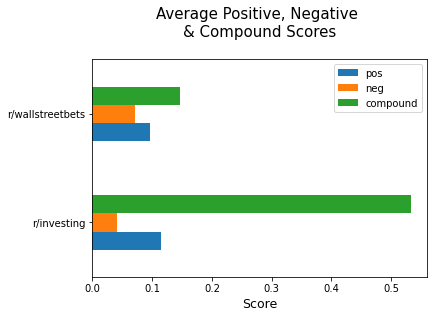
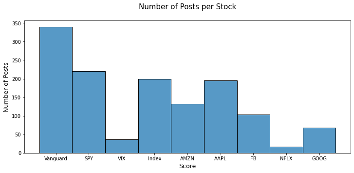
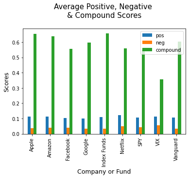
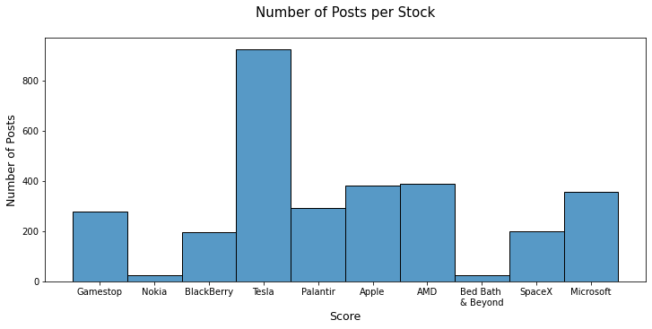
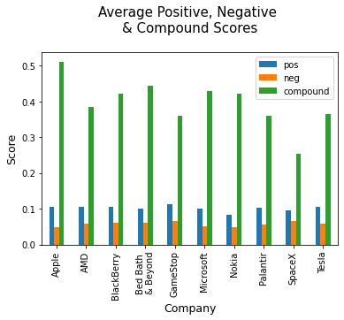
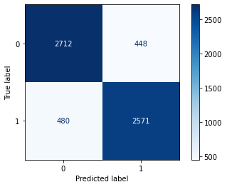
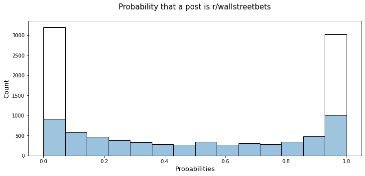

#  Project 3: Web APIs & NLP

# Parliament Investing
### Wisdom of the Crowd using Classification

 ## Contents:
 
- [Problem Statement](#Problem-Statement)  
- [Data](#Data)
- [Outside Research](#Research)
- [Data Gathering](#Data-Gathering)
- [Sentiment Scoring & EDA](#Data-Analysis-&-EDA)
- [Data Modelling](#Data-Modelling)
- [Conclusions and Recommendations](#Conclusions-and-Recommendations)

## Background:
The game of investing has changed. It is no longer in the hands of the few elites. Trading on the Wall Street floor was disrupted with online brokerages. More recently, retail investors forced the hands of traditional brokers into offering free trades with the popularity of the Robinhood platform. Robo-advisors are attempting to disrupt the financial advisor role by using algorithms to base investments on and allow people to passively invest.

## Problem Statement:

Imagine using the wisdom of the Main Street crowd applied to investing strategy to get ahead of Wall Street competitors on learning what is trending… All while being able to save money on hiring a team of expensive analysts. We will focus on 2 subreddits: r/investing and r/wallstreetbets, using Natural Language Processing to classify text within the corpuses in order to form an investing strategy.

## Data

* [wsb](./Code/data/wsb.csv): Original scraped documents from subreddit: r/wallstreetbets
* [investing](./Code/data/investing.csv): Original scraped documents from subreddit: r/investing
* [combined](./Code/data/combined.csv): Combined corpuses from r/wallstreetbets and r/investing into single dataframe with equal weighting
* [sentiment](./Code/data/sentiment.csv): Added sentiment score analysis to the combined data set.

## Outside Research:

Data Source: https://reddit.com/r/investing
Web API: https://api.pushshift.io/reddit/search/submission?subreddit=wallstreetbets

Data Source: https://reddit.com/r/wallstreetbets    
Web API: https://api.pushshift.io/reddit/search/submission?subreddit=investing

## Data Gathering:

I started by using the Push Shift API to scrape a corpus of documents from both subreddits. After noticing that roughly 40% of documents had their main selftext removed, I decided to compensate by scraping extra posts.

I then checked the number of null values in each corpus & decided to drop them all as there were not a high proportion of nulls to overall number of documents.

After dropping the nulls I also dropped all documents with the text that had been removed.

I then combined the data set and moved into Data Analysis.

## Sentiment Scoring & EDA

I chose to use the VADER Sentiment Intensity Analyzer from nltk to check the overall tones of the each subreddit:

The chart above in conjunction with looking at the top 5 most positive and most negative posts from each subreddit, overall both have a positive tone. However, the wallstreetbets subreddit has high negative scores in addition to the high positive scores, which is an indicator of the higher risk involved with strategies used on r/wallstreetbets.

I then honed in on the r/investing subreddit:

Overall the r/investing subreddit is fond of passive invseting strategies using index funds, and especially Vanguard. Overall this subreddit is more geared toward beginners looking for less risky investments while still being involved in the stock market.

I then honed in on the r/wallstreetbets subreddit:

Overall the r/wallstreetbets subreddit is fond of active options trading and placing huge bets in order to maximize return. Overall this subreddit is more geared toward people that know just enough to be "dangerous."

## Data Modelling

I established a baseline of 50% accuracy, which was a given beacuse of how the scraped data was combined.

I decided from the start that the metric that I would like to optimize is Recall. I chose recall because if someone has the a lower risk tolerance but they are placed in a r/wallstreetbets based investments they will not be happy with the volatility.

I used TFIDF with stop words set to english in order to vectorize the text from each document. I added on the sentiment scores onto the new vectorized dataframe and fit several models:

#### Logistic Regression

I fit and scored a Logistic Regression model, which had accuracy scores of 0.85 and a recall score of 0.84 on unseen testing data.

This model scored much higher than the baseline model of 50%.

#### Multinomial Naive Bayes

Not using the 'compound' feature because it contains negative values, I fit and scored a Multinomial Naive Bayes model which had accuracy scores of 0.85 and a recall score of 0.84 on testing data.

Overall this model had the lowest variance between the training and testing data. The overall scores were in line with what was achieved using Logistic Regression.

#### Kernel Support Vector Machine Classifier

I fit and scored a Kernel Support Vector Machine model, with the polynomial kernel function and degrees set to 2. The model had accuracy scores of 0.80 and a recall score of 0.79 on unseen testing data.

Overall this model was overfit and had a worse recall score than the 2 above. Since this is a black box model and you can't interpret it I was not going to use the model as my final unless the recall score was significantly higher.
    
## Conclusions and Recommendations:

I chose to go with the Logistic Regression as my final model due to it's interpretability and relatively similar recall scores across the board.

#### Coefficient Explaination

If a document moves up a unit of negative sentiment, they are 1.85 times more likely to be in r/wallstreetbets. Similarly, if a document moves up a score of positive sentiment, they are 2.65 times more likely to be in r/wallstreetbets. This is because r/wallstreetbets on a whole is based on a much more volitile strategy than r/investing. As someone moves up in Neutrality, they are only 0.5 times as lilely to be in r/wallstreetbets.

#### Placing Customers into Investing Strategies based on their Risk Assesment

I used logreg.predict_proba to extract probabilities from the model that the post belonged to the 0 Class (r/investing) or the 1 class (r/wallstreetbets).

Customers would be placed into investment strategies based on the probability that their risk assesment statement would classify as r/investing and r/wallstreetbets, using these percentages as weighting.